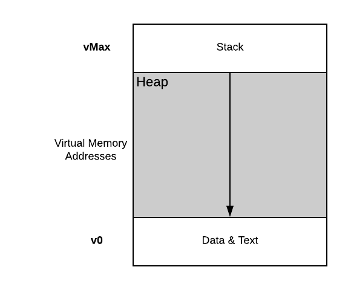
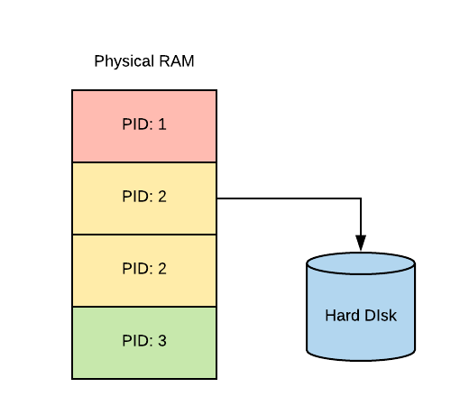
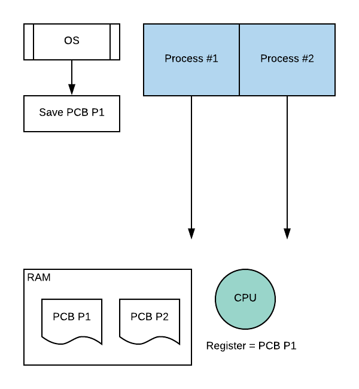
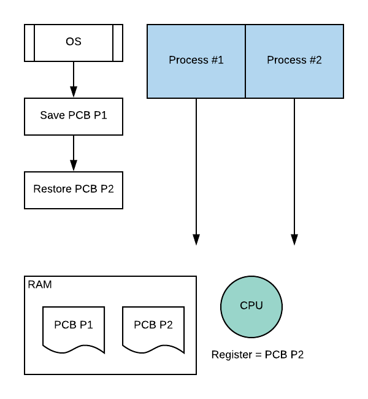
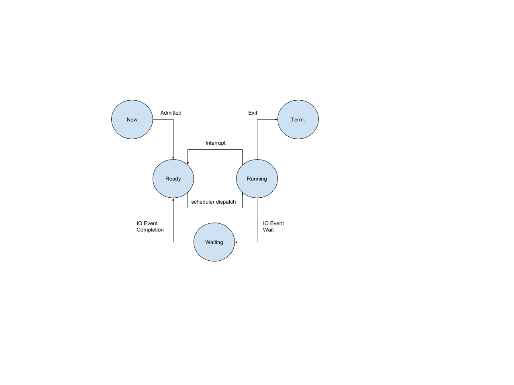
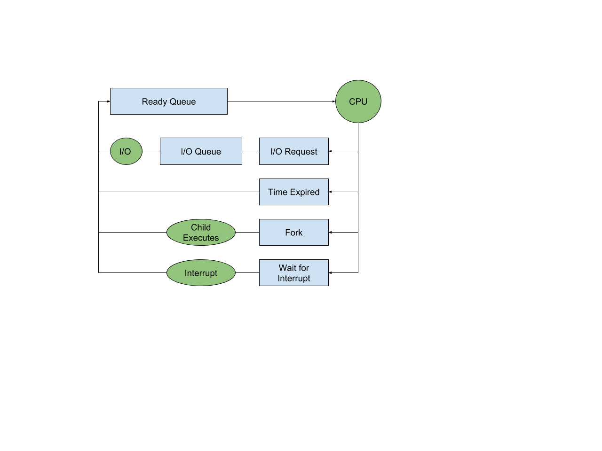

# Process & Process Management

## Process

What is a process? Application is a program on hard disk or flash memory; it is a static entity.
Process is the state of a program when it is executing on CPU or loaded into memory; it is an active
entity.

Within a process, we have this address space which is comprised of the following items.

1. Text and data are static state and they become available when the process is first initialized.
2. Heap is a dynamically created state during the execution of a process.
3. Stack is a dynamically created state in which it grows and shrinks upon execution.
    - Executions are function calls. The stack keeps track of procedure.

## Address Space

We refer addresses inside the address space as *virtual addresses* because they are not physical
address to the physical RAM. Instead, OS uses a *page table* to map virtual addresses to physical
addresses. Some parts of the virtual addresses may not be allocated because there may not be enough
physical memory for all states. When memory is running low, OS will temporarily swap out some parts
of the memory and put them onto hard disk.

Therefore, the OS must maintain information regarding the mapping of virtual address space to
physical address space and to hard disk if necessary.

## Process Control Block (PCB)

For an operating system to manage processes, it has to have some kind of idea of what they are
doing. For example, the process needs to know program counter of a set of instruction that is
running on the CPU. The program counter is actually maintained on the CPU while the process is
executing in a register.

We can now introduce a data structure called PCB to describe what are the information an OS needs to
manage a process. PCB contains the following states.

- Process state
- Process number
- Program counter
- Registers
- Memory limits
- List of open files
- Priority
- Signal mask
- CPU scheduling info
- Etc…

Suppose we have two processes running. Two process control block will be created in memory. Now P1
is running on CPU. The register will take PCB from P1 and perform updates on it while it is
executing instructions from P1.

At some point, the OS decides to interrupt P1 and make it IDLE. OS needs to save all the state
information regarding P1, including data on CPU register, into PCB of P1. Then OS will restore the
state of P2.  

Then set P2 to run on CPU and inject state data into register. If at some point, P2 needs more
physical memory, it will make a request via the `malloc` call. OS will then allocate memory and
establish new virtual to physical address mapping for P2.

## Context Switch

Context switch is the mechanism used by the operating system to switch the execution from the
context of one process to the context of another process. This is an expensive operation because

1. Direct cost is the number of cycles for load and store instructions
2. Indirect cost is when CPU encounters cache misses.

Accessing data in cache is on the order of cycles, but accessing data from memory is on the order of
hundreds of cycles. When P1 was initially running on the CPU, all of its data are in the cache, but
as soon as we switch execution to P2, all of cached data become irrelevant to P2. As P2 executes,
CPU will have to evict some of the data of P1 to make room for P2 data. Next time when P1 starts
executing again, all of its data are missing and are required to pull from memory again. This is
known as having a **cold cache**.

## Process State

A process has multiple state during its life cycle in an operating system.

- New
- Ready
- Waiting
- Running
- Terminated

## Process Creation

In operating systems, a process can create child processes. When the computer starts, the booting
mechanism is done by loading the operating system into a privileged process and this is going to be
our parent process or root process. It will then create some number of initial processes like a user
shell process when a user logins. If user enters a command in the terminal, a new child process will
spawn. The final relationship will look like a tree.

Most operating system supports two mechanism for process creation.

### `Fork`

It copies the parent PCB into new child PCB. Child continues execution at instruction after fork
this is because both parent and child have the exact same process control block, which includes the
value of program counter.

### `Exec`

It will create a process via a fork but it will not leave its PCB values to match the parent’s
values. It loads a new program and starts from first instruction. In Unix-based OS, init is the
parent of all processes, while in Android OS, Zygote is the daemon process that launches app
processes.

## CPU Scheduler

For a CPU to execute a process, the process must be in ready state. However, there are multiple
ready processes waiting in the ready queue. How does the OS pick which one to run? A CPU scheduler
determines which one of the currently ready processes will be dispatched to the CPU to start
running, and how long it should run for.

Overtime this means that in order to manage the CPU, the OS must be able to preempt, to interrupt
the executing process and save its current context. And then the OS must run its scheduling
algorithm to choose one of the ready processes that should run next. Once it is chosen, the OS will
dispatch the process onto the CPU and switch into its context.  

### Length of Process

How long should a process run for? How frequently should we run the scheduler? There are couple
scheduling design decisions we need to make.

- What are the appropriate time slice values?
- What’s the metric to choose next process to run?

### I/O

Whenever a process makes an I/O call, the OS must swap out this process from the CPU and puts it
into an I/O queue. When I/O operation is completed, the process will return back to a ready queue.

Scheduler has no control over when the I/O actually occurs and no control over external events on
when they are generated. Scheduler is only responsible for maintaining the ready queue.

## Inter-Process Communication (IPC)

The operating system goes through a great deal to protect and isolate processes from one another.
Each of them is a different address space. Each of them gets different amount of CPU time. The
communication mechanism must be built around all these protection mechanism.

IPC transfers data between address spaces and maintains protection & isolation. IPC also needs to
provide flexibility and performance.

### Message-Passing

OS provides a communication channel, like a shared buffer between two processes. Each process writes
and reads messages to/from the channel. The benefit of this approach is having OS to manage the
channel. It’s merely a system call to the OS. The downside is the overhead of copying data from
process address space into a channel that sits in the kernel memory.

### Shared Memory

OS establishes a shared channel and maps it into each process address space. Processes can directly
read/write into their own address space. The OS maps the shared space onto the same chunk of
physical memory. So the OS is completely out of the way for this communication approach. Although it
is faster, it is more error prone due to the lack of protection from OS.

## Additional Resources

[Stack Overflow](https://stackoverflow.com/questions/18575235/what-do-multi-processes-vs-multi-threaded-servers-most-benefit-from)