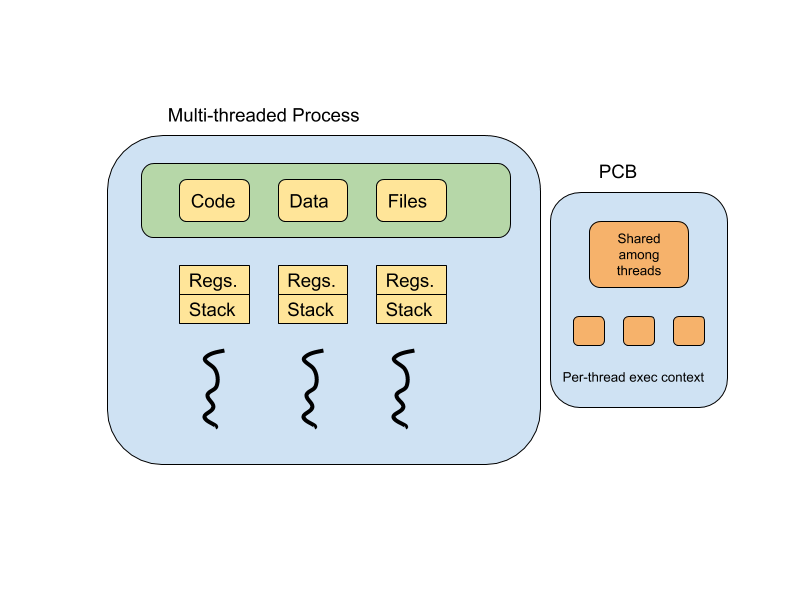
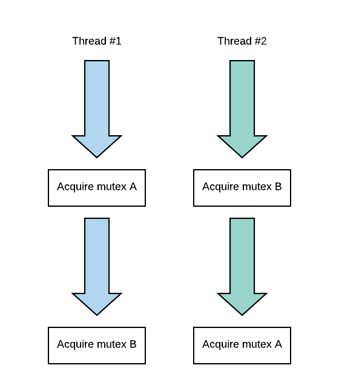

# Threads

## Process vs Thread

Threads represent multiple, independent execution contexts. They are part of the same virtual address
space which means they share all of the virtual to physical address mappings. They will share all the
code, data, files but they will execute different instructions and access different portions of that
address space. **Each thread will need to have a different program counter, stack pointer, stack, and
thread-specific registers.**



## Benefits of Thread

Each thread running on a different processor (CPU core) has access to its own processor cache. If
the thread repeatedly executes a smaller portion of the code, more of that state of that program
will be actually present in the cache. Thus, the performance benefit is that we are executing with
a hotter cache.

*Why not run a multi-process application instead of multi-threading?*

Since the processes do not share an address space, we have to allocate for every single one of these
context address space and execution context. The memory requirement will be much higher. However, one
can argue that single threaded multi-process application is easier to program since the developer does
not need to worry about thread safety. Another benefit of multi-threading is that it less costly to
communicate data within a process than inter-process.

The real cost of context switching between processes is the remapping of virtual address space to
physical address space. Since threads share an address space, when we context switch threads, the
cost is relatively small.

## Thread Mechanism

In order to implement OS thread, we need the following.

1. Thread data structure
    - Identify threads and keep track of resource usage
2. Mechanism to create and manage threads
3. Mechanism to safely coordinate among threads
    - Concurrency in the same address space, e.g. avoid data race

Since threads share the same address space, two threads can simultaneously access the same physical
memory address space. This can introduce some serious problem as one thread is reading while the other
thread is writing, or both threads are trying to update the data at the same time.

### Thread Creation

Let’s see what we need to represent a thread. The thread type, proposed by Birrell, is the data
structure that contains all information that’s specific to a thread and that can describe a thread.
This includes the thread ID, program counter, stack pointer, registers, stack, and other attributes.

In order to create a thread, Birrell proposed fork.

```bash
fork(proc, args)
```

The first parameter is a procedure that the created thread should immediately execute, think of it
as a function that is passed into a thread. The args are arguments for the procedure. Similar to the
following.

```python
thread = Thread(job=compute_something, 100, 100)
```

This fork should not be confused with the Unix system call. When a thread T0 calls a fork, a new
thread T1 is created. T1’s fields are initialized such that its program counter will point to the
first instruction of the procedure proc. After the fork operation completes, the process as a whole
has two threads.

*What happens when T1 finishes?*

One programming practice would be to store the results of the procedure in some well-defined location
in the address space that’s accessible to all the threads. More generally, however, we need some
mechanism to determine that a thread is done. Birrell proposed a mechanism he calls join. When the
parent thread calls join with the thread ID of the child thread, it will be blocked until the child
completes its computation. Join will return to the parent the result of the child’s computation.

Here’s an example in C

```c
Thread t1;
list<int> my_list;
T1 = fork(safe_insert, 4);
safe_insert(6);
join(thread1);
```

### Mutexes

When the parent thread and the child thread are simultaneously updating the list, there is a danger
with one thread overwriting the result of another. To solve this problem, the operating system
typically supports a construct called mutex. A mutex is like a lock that should be used whenever
accessing data or state that’s shared among threads. The portion of the code protected by the mutex
is called critical section.

```c
list<int> my_list;
Mutex m;
void safe_insert(int i) {
    Lock(m) {
        my_list.insert(i);
    }
}
```

### Conditional Variables

Mutex is a binary operation, it is either locked or unlocked. What if the computation that you wish
to perform needs to occur only under certain circumstances?

For instance, what if we have a number of producer threads that are inserting data to a list and
then we have one special consumer thread that has to print out and then clear the contents of the
list once it reaches a limit? We want to make sure that this consumer thread only really gets to
execute its operation under these certain conditions when the list is actually full.

```c
// Consumer
lock(m) {
    while(!my_list.full()) {
        wait(m);
    }

    my_list.print_and_remove_all();
}

// Producer
lock(m) {
    my_list.insert(my_thread_id);
    if (my_list.full()) {
        signal();
    }
}
```

On the consumer side, the lock is automatically released once we enter the wait statement. On the
producer side, the signal will wake up the wait function in consumer. Once the consumer is awaken,
the lock is acquired again.

#### API

In summary, we have a condition type, which is `sync.Cond` for Golang.

- Wait takes in a mutex and a condition. The mutex is automatically released and re-acquire on wait.
- Signal takes in a condition, and it notifies one thread waiting on condition.
- Broadcast takes in a condition and it notifies all threads waiting on the condition.

### Reader/Writer Problem

At any given time, zero or more of the reader’s threads can access a resource, but only zero or one
writer thread can access the resource concurrently at the same time. One naive approach to the problem
is that we simply protect the entire resource with a mutex. This is, however, too restrictive for the
reader/writer problem.

This is preventing us to have multiple reader to access the resource at the same time. It is actually
okay to perform multiple read on a resource that is not being modified.

We can come up with some conditions that are acceptable.

- When there is no reader and no writer, the resource is OK for read and write access.
- When there is one or more reader and no writer, the resource is still OK for read access.
- When there is one writer, the resource is NOT ok for read or write access.

### Solution

We can now use a resource counter variable to represent such state.

- `-1` means there is a writer accessing the resource
- `0` means there is no reader and no writer accessing the resource
- `>0` means there is N number of reader accessing the resource

On the reader side, when we see that resource counter is negative one, we will perform a wait for the
read phase. Once read phase is signaled, it performs an increment on resource counter. It then releases
the lock and performs a read on the data. Once read is complete, it will acquire the lock again and
signal the write phase if no other readers are concurrently reading the resource.

```c
// Reader

Lock(counter_mutex) {
    while (resource_counter == -1) {
        Wait(counter_mutex, read_phase);
    }
    resource_counter++;
}

// Logic to read data

Lock(counter_mutex) {
    resource_counter--;
    if (resource_counter == 0) {
        Signal(write_phase);
    }
}
```

On the writer side, when we see that resource counter is not zero, we will perform a wait for the write
phase. Once write phase is signaled, it sets the counter to negative one and then perform the logic
to write data. Once write is complete, it will acquire the lock again and signal the read phase to
reader threads and also the write phase to itself.

```c
// Writer

Lock(counter_mutex) {
    while (resource_counter != 0) {
        Wait(counter_mutex, write_phase);
    }
    resource_counter = -1;
}

// Logic to write data

Lock(counter_mutex) {
    resource_counter = 0;
    Broadcast(read_phase);
    Signal(write_phase);
}
```

### Critical Section

Although it seems complicated, we can actually generalize the problem by breaking them down into
critical sections.

```python
with mutex:
    while not predicate_indicating_access_ok:
        wait(mutex, cond_var)

    update_state()

    signal(cond_var) or broadcast(cond_var)
```

Now for reader code block and writer code block, there are essentially four of these critical sections.
The critical section is protecting the state variable instead of the actual data variable.

1. Enter critical section
2. Perform critical operation on shared resources
3. Exit critical section

Enter critical section can be described by the following code.

```python
with mutex:
    while not predicate_for_access:
        wait(mutex, cond_var)

    update_state()
```

Exit critical section can be described by the following code.

```python
with mutex:
    update_predicate()
    signal/broadcast(cond_var)
```

### Avoid Common Pitfalls

- Keep track of mutex and conditional variables used with a resource
- Check that you are always using lock and unlock
- Use a single mutex to access a single resource
- Check that you are signaling the correct condition
- Check that you are not using signal when broadcast is needed

## Deadlocks



Here comes the classic problem of deadlock, where two threads are waiting for each other to release
their resources. So how do we avoid it?

1. Unlock A before locking B, or the other way around
2. If two locks are necessary, then get all the locks upfront and release at the end.
3. We can also choose to use one mega lock to lock all resources.

The most accepted solution is to maintain lock ordering. Both threads should acquire mutex A first
and then mutex B.

## Kernel vs User Threads

Kernel level threads are visible to the kernel and are managed by kernel level components like the
kernel level scheduler. They may be directed to support some of the processes, like execute some of
the user-level threads and some other kernel level threads may be there just to run certain OS level
services.

At the user level, the processes themselves are multi-threaded and these are the user-level threads.
For a user-level thread execute, it must be associated with a kernel level thread. And then the OS
scheduler must schedule that kernel-level thread onto a CPU.

### One-to-One

Each user level thread has a kernel level thread associated with it.

- (pos) OS sees and understands threads, synchronization, and blocking.
- (neg) It must go to the OS for all operations which may be expensive.
- (neg) OS may have limits  on policies and thread numbers.
- (neg) Poor portability from one OS to another.

### Many-to-One

Multiple user-level threads from the same process are mapped to a single kernel-level thread. At the
user-level, there is a thread management library that decides which one of the user-level thread will
be mapped onto the kernel-level thread at any given point of time. That user-level thread will only
run once the kernel-level thread is actually scheduled on the CPU.

- (pos) It is totally portable, it doesn’t depend on OS limits and policies.
- (neg) OS has no insight into application needs.
- (neg) OS may block entire process if one user-level thread blocks on I/O.

### Many-to-Many

It allows some user-level threads to be mapped onto some kernel-level threads.

- (pos) This is the best of both worlds.
- (pos) It can have bound or unbound threads.
  - Unbound means that user-level threads may be scheduled onto any of the kernel-level threads.
  - Bound means that we can have some particular user-level threads mapped one-to-one on some specific kernel-threads.
- (neg) It requires coordination between user and kernel level thread managers.

## Scope

User level library manages threads within a single process, thus it is process scope. OS manages
system-wide threads via CPU scheduler, thus this is system scope.


Let’s say the webserver has twice as many threads as the database. If the user-level threads have a
process scope, the OS doesn’t see all the threads. So the OS may choose to allocate 2 kernel threads
to the web server and 2 kernel threads to the database to achieve an equal share of resource allocation.
The end result is that the each thread in the web server will only receive half the CPU time of those
threads in the database.

However, if we put the threads on the system level, then the OS will get to give an equal CPU time
share to each thread. Thus, it is a choice that the user must make to decide on which scope to put
the threads on.

## Multi-Threading Patterns

### Boss-workers Pattern

There is one boss thread and many worker threads. The boss thread is responsible for assigning work
to the workers. The worker will carry out the actual execution of a task.

Whenever we have a job, we first give it to the boss. The boss will distribute the work to worker.
The bottleneck of this design is on the boss thread. The throughput of the system is limited by how
much efficient can the boss thread assign work to worker threads.

Pro

- The workers don’t need to synchronize
- Alternative approach is to use a job queue to reduce the overhead of managing workers.
- Workers can be specialized in tasks to keep CPU cache hot.

Cons

- Boss must keep track of what each worker is doing.
- Throughput will go down.
- If the worker threads are specialized, load balancing is more challenging.

Thread pool is the common approach to create a worker pool. We pre-define a fixed size of thread pool
to service the boss thread. Whenever there is a need, we double the size of the thread pool to handle
extra work.

### Pipeline Pattern

In this approach, threads are assigned one subtask of the whole system. Entire task is completed by
a pipeline of threads.We will break the task into multiple stages. If a stage has more workload than
others, we can assign a thread pool for that particular stage.

Pro

- Threads are specialized and maintain locality

Con

- Balancing and synchronization overhead
