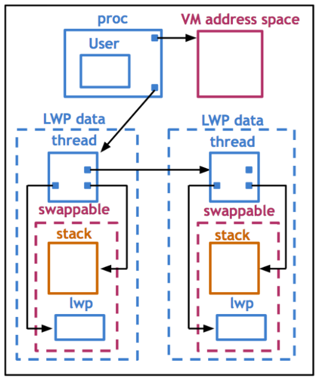

# Thread Design Considerations

## Thread Data Structures

As we have multiple threads in multiple processes running multiple CPU cores, the data structure of
thread management needs to be scalable.

### At Scale


We will need multiple copies of the user/kernel level thread data structure and PCB to describe the
threading information for each running process.

The threading library usually keeps track of all of the user level threads by having them in heap
space. Thus, There's a relationship between the virtual address mapping and various thread ID, thread
register count, and thread stack.

We also need to maintain a relationship between the kernel threads and the CPU, such as what is the
CPU that a kernel thread has affinity to, when it was last scheduled and etc...

When two kernel threads belong to the same address space. There will be information in the process
control block that is relevant for the entire process. And there will be information that is just
specific to one kernel thread, e.g. signals and system call arguments. Now we can split up the PCB
into two parts.

1. Hard process state contains information relevant for all of the user level threads within the process.
2. Light process state contains information relevant for a subset of user level threads.

### Benefit

If we only have one single PCB,

* Large contiguous data structure
* Private for each entity
* Saved and restored on each context switch
* Update for any changes

There are multiple limitations using this one single PCB.

* Scalability is limited due to the size of the structure.
* Overheads are limited because they need to have private copies.
* Performance is affected because everthing has to be saved/restored.
* Flexibility is limited because any small update has to touch the whole state.

If we have multiple data structures, just like microservices

* Smaller data structures
* Easier to share
* On context switch, only save and restore what needs to change
* User-level library needs only update portion of the state.

## Solaris 2.0

Let's consider the Solaris 2.0 implementation as an example of how OS implements its thread data
structure.

* *Implementing Lightweight Threads* by Stein and Shah
* *Beyond Multiprocessing: Multithreading the Sun OS Kernel* by Eykholt et.al.

### User Level


The OS is intended for multi-processor systems. There are multiple kernel threads running at all times.
At the user level, the processes can be single or multithreaded. Both many-to-many and one-to-one
mappings are supported. Each kernel thread that is executing user level thread has a light weight
process (LWP) data structure associated with it. The LWP(s) represent the virtual CPU onto which
it's going to be scheduling the user level threads.

### Kernel Level



#### Process

* list of kernel threads
* virtual address space
* user credentials
* signal handlers

#### Light-weight Process (LWP)

Similar to user level thread, but this is visible to the kernel and it is not needed when process is
not running on CPU.

* user-level registers
* system call arguments
* resource usage information
* signal mask

#### Kernel-level Threads

This information is kept even when process is not running on CPU. 

* kernel-level registers
* stack pointer
* scheduling information
* pointers to associated LWP, process, and CPU structures

#### CPU

* current thread that is executing
* list of kernel-level threads
* dispatching and interrupt handling information

## Interrupt and Signals

Interrupts are events that are generated externally to a CPU by components that are other than the
CPU where the interrupt is delivered, e.g. I/O devices, timers, and other CPU(s).

* Determined based on physical platform
* Appear asynchronously

Signals are events that are triggered by the software that's running on the CPU.

* Determined based on operating system
* Appear both synchronously or asynchronously

Both interrupts and signals have a unique identifier depending on the hardware or OS. Both can be
masked and disabled/suspended via corresponding mask. We can use either per-CPU interrupt mask or
per-process signal mask.

If the mask is indicating that interrupt or signal is enabled. It will invoke or trigger the
corresponding handler.

* Interrupt handler is set for the entire system by OS
* Signal handler is set on per process basis, by process

Using an analogy, we can say that an interrupt is like a snowstorm warning, generated by the external
environment of a toy shop, while a signal is like battery running low warning, generated by the
actual toy shop.

### Interupt Handling

When a device, like disk for instance, wants to send notification to CPU, it sends an interrupt by
sending a signal through the wire or PC Express to the CPU. The interrupt can be uniquely
identified. The OS will have interrupt signal ID mapped to handlers. Interrupt will cause a thread
to context-switch off the CPU and run kernel mode on the CPU.

### Signal Handling

Signals are not generated by external entities. For instance, if a thread tries to access memory
location that hasn't been allocated, it is performing an illegal memory access. A signal `SIGSEGV`
will be generated by the OS, which is `SIGNAL-11` in Linux. OS has some default actions for handling
signals.

Default:

* Terminate process
* Ignore

Synchronous Signal

* SIGSEGV (access to protected memory)
* SIGFPE (divide by zero)
* SIGKILL (kill thread ID)

Asynchronous Signal

* SIGKILL (kill another thread)
* SIGALARM

### Masks

Mask allows us to dynamically enable or disable whether the handling code can interrupt an executing
mutex. Suppose we are interrupting a thread that has acquired a lock, the handler code is expecting
to claim lock. In this situation, we are running into a deadlock. Mask is a sequence of bit where
each bit corresponds to a specific interrupt or signal.

When an event occurs, we first check the mask and see if the signal or interrupt handler is enabled,
then we proceed with teh actual handler invocation.

Interrupt masks are maintained on per CPU basis. If mask disables interrupt, hardware interrupt will
not deliver to CPU.

Signal masks are per execution context. If mask disables signal, kernel sees mask and will not
interrupt corresding thread.

## Tasks

In Linux, the main abstraction that it uses to represent an execution context is called a task. And
it is represented via corresponding task structure. It is essentially the execution context of a
kernel level thread. A single threaded process will have one task and a multi-threaded process will
have many tasks.

```c
struct task_struct {
    // ...
    pid_t pid;
    pid_t tgid; // task group ID
    int prio;
    volatile long state;
    struct mm_struct *mm;
    struct files_struct *files;
    struct list_head tasks;
    int on_cpu;
    cpumask_t cpus_allowed;
    // ...
}
```

Linux never has one contigious process control block. The process state is always represented
through a collection of references to data structures like memory management, file management,
etc...

The current implementation of Linux threads is called Native POSIX Threads Library (NPTL) where
all user level threads are mapped one to one on kernel threads. This is abandoning the previous
idea of many user threads can map to one OS threads or many to many relationships. The kernel sees
every user level threads. This makes the kernel traps much cheaper. Also nowadays we don't have any
more memory constraint, we can create as many kernel threads we see fit.