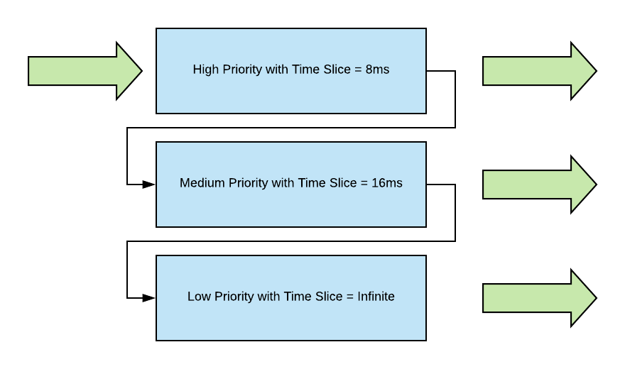
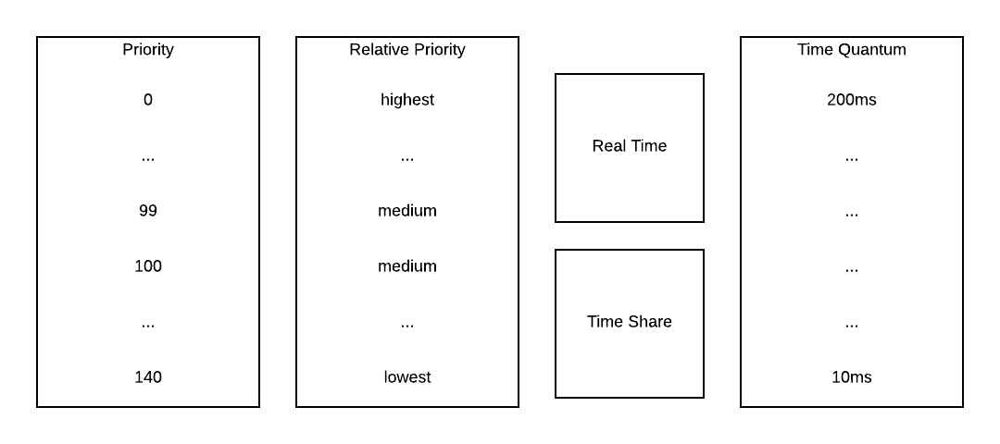
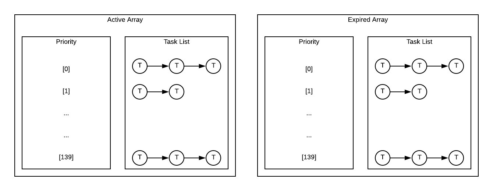
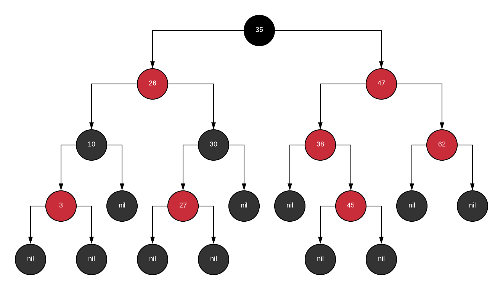
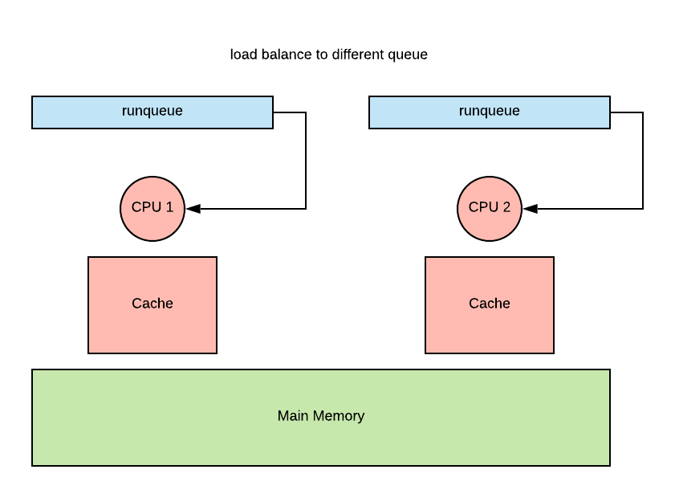

# Scheduling

## Overview

CPU scheduler chooses one of the ready tasks to run on CPU. It runs when CPU becomes IDLE. This
occurs when a thread is making system call and enters the I/O request cycle. It can also run when
a new task or thread becomes ready and enters the ready queue. When a thread is dispatched onto a
CPU, it performs a context switch, enters user mode, and set the appropriate program counter.

Question is which task should be selected? That depends on the OS scheduling algoritm and policy.

The design of the ready queue (also known as the run queue) and the scheduling algorithm are tightly
coupled.

## Types of Schedulin Policy

### Shortest Job First (SJF)

There are couple assumptions we must make first.

1. We know the execution time for each task
2. We only have 1 CPU
3. Scheduler does not preempt running task, each task is run to completion.

We can maintain a BST as a the run queue, and then as we insert new tasks to the run queue like we
insert a node to a BST. Whenever the scheduler needs to pick a task, it picks the left most node
because that is the task with the least execution time. Of course, we can also use a heap tree to
create a min heap.

### SJF with Preemption

Suppose each task does not arrive at the same time. We have the following three tasks.

| Task | Execution Time | Arrival Time |
|------|----------------|--------------|
| T1   | 1 sec          | 2            |
| T2   | 10 sec         | 0            |
| T3   | 1 sec          | 2            |

Since T2 is arrived first, the scheduler will run T2 first. However, we are allowed to perform a
preemption, i.e. we can stop T2 from running and resume it later.

```text
T1 __-_________
T2 --__--------
T3 ___-________
```

Whenever the task enters the run queue, the scheduler needs to examine the execution time of
different task and determines which one has the shortest remaining execution time. However, it is
difficult in principle to know the exact execution time of each task, we must use some heuristics
based on history to make an estimate.

### Priority with Preemption

Each task may have different priority level. Instead of looking at execution time, we can look at
task that has the highest priority for scheduling. Whenever a new task with higher priorty appears
in the run queue, the current running task must be preempted.

| Task | Execution Time | Arrival Time | Priority |
|------|----------------|--------------|----------|
| T1   | 1 sec          | 2            | P1       |
| T2   | 10 sec         | 0            | P2       |
| T3   | 1 sec          | 2            | P3       |

Although T2 arrives first, it must be preempted upon the arrival of T1 because T1 has the highest
priority. After T1's completion, the execution should resume on T2 because T2 has higher priority
than T3.

```text
T1 __-___________
T2 --_----------_
T3 _____________-
```

We can achieve this scheduling policy by maintaining multiple priority queue, e.g. P1 queue,
P2 queue, and etc... The scheduler should always pick from the non-empty queue with highest
priority. Priority should a function of `effective_priority(priority, time_in_queue)` to avoid
starvation.

### Priority Inversion

Priority can be inverted if a high priority task is waiting for a lock to be released by a low
priority task. This will cause the low prioirty task to finish before the high priority task. We
can avoid this situation by a temporarily boosting of priority on the low prority task such that it
can release the lock sooner. The temporary boosting will go away as soon as the low priority task
releases its lock.

### Round Robin

Scheduler picks up the task that is arrived. The task may yield to wait on I/O operation. Then the
scheduler will do a round robin to select the next task to run. We can incorporate priority in the
round robin approach as well, but that means we need preemption.

## Time Slice

A time slice is the maximum amount of unterrupted time given to a task, also known as the time
quantum. Task may run less than the time slice when it is waiting for I/O or release of a mutex.
Tasks become interleaved and they timeshare the CPU. If a task is CPU bound, it will be preempted
after timeslice.

With the time slice approach, we have the following benefits

- Short tasks finish sooner
- System is more responsive
- Lengthy I/O operations are initiated sooner

### Length of a Time Slice

It depends on whether the system has more I/O bound tasks or CPU bound tasks.

For CPU bound tasks, it is better to have a long time slice because we want to minimize context
swithc as much as possible. When it comes to CPU bound tasks, users only care about throughput and
average completion time. They don't care about how long does a task need to wait before it starts
execution.

For I/O bound tasks, the value of time slice is actually not very relevant because the task will
always get switched off CPU when it enters I/O operation. The context switch in this case is
inevitable. However if we have a mixture of CPU bound and I/O bound tasks, it will actually result
in a better performance if the time slice is small. The key is that the I/O task will have its
I/O operation starts sooner. The wait time is utilized for CPU bound task.

## Runqueue Data Structure

If we want I/O bound and CPU bound tasks to have different time slice values for optimization, then
we can consider

- One runqueue but check type for each task
- Two different runqueues, one for CPU bound another for I/O bound

If we maintain a different queue for different type of tasks, we can have the following choice.

- Queue 1 has time slice of 8 ms with highest priority, reserved for I/O intensive tasks.
- Queue 2 has time slice of 16 ms with medium priority, reserved for mixture of I/O and CPU tasks.
- Queue 3 has time slice of infinity with lowest priority, reserved for CPU intensive tasks.



The challenge here is that we don't really know whether the tasks are CPU or I/O bound. We can take
this approach.

1. Tasks enter top most queue
2. If task yields voluntarily, keep task at this level because it is I/O bound intensive
3. If task uses entire time slice, push down to lower level
4. Task in lower queue gets priority boost when releasing CPU due to I/O operations.

This is called the **multi-level feedback queue**.

### Linux O(1) Scheduler

The O(1) scheduler is a constant time select/add task scheduler, regardless of the number of
available tasks. It is preemptive and priority based. It has a total of 140 priority levels, with
zero being the highest and 139 the lowest. These priority levels are organized into two different
classes, real time (0-99) and time sharing class (100-139).

All user processes have one of the time sharing priority levels. The default priority level is 120.
The nice values can adjust the priority level ranging from -20 to 19.

It associates different time slice value with different priority level. It also uses feedback to
make adjustments for priority levels on tasks.



#### Timeslice Value

- Depends on priority
- Smallest for low priority tasks
- Highest for high priority tasks

#### Feedback

- Sleep time: waiting or idling
- Longer sleep means more interactive, receives priority boost -5
- Smaller sleep means compute-intensive, receives priority decay +5

#### Runqueues

The runqueues are organized into two arrays of tasks. Each array element points to the first
runnable task at the corresponding priority level.



Active tasks are used to pick the next task to run. It is constant time to select. One just need
to index into the array for a given prority level. It is also constant time add because each array
list has a pointer to its tail.

If tasks yield the CPU to wait on an event, the time they spent on the CPU is subtracted from the
total amount of time. If the remaining time is still less than the timeslice, tasks will remain in
queue in the active array until timeslice expires.

Expired tasks are inactive, in the sense that they won't be placed on the CPU as long as there are
tasks on the active array. When there are no more taks in the active array, the expired tasks will
be swapping pointers with the active tasks. The whole cycle repeats.

The O(1) scheduler affected the performance of interactive tasks significantly. For this reason,
the new Linux scheduler uses CFS.

### Linux CFS Scheduler

In O(1) scheduler, once tasks are placed on the expired list, they wouldn't be scheduled again
until all remaining tasks from the active list have a chance to execute. As a result, all
interactive tasks experience a lot of jitter.

Completely Fair Scheduler (CFS) uses a red-black tree as its runqueue structure. The tasks are
ordered by virtual runtime (time spent on CPU) on the tree. CFS tracks its virutal runtime in
a nanosecond granularity. The tasks with less virtual runtime needs to be scheduled sooner to
ensure fairness.



As the algorithm goes, CFS will always pick the left-most node on the tree. Periodically CFS will
adjust the virtual runtime of the task that's currently running on the CPU and compare it to the
virtual runtime of the left most task on the tree. If it is smaller, the task will remain on the
CPU, else it will preempt and be placed in the tree. The CFS will select the left-most node to run.

Virtual runtime progress rate depends on priroity and niceness.

- Rate faster for low priority tasks
- Rate slower for high priority tasks
- Use same tree for all priorities

In summary,

- Select task is O(1)
- Add task is O(log n)

## Scheduling on Multiprocessors

First we look at a shared memory multiprocessor architecture, which is the default of running one
process with multiple threads running on multiple CPU cores. Each CPU has its own private cache and
memory is shared in the RAM.

When a thread is running on a core, its cache will become hot. We want to avoid re-scheduling this
thread on a different CPU to avoid cold cache. This concept is known as cache affinity.We can
achieve this with a hiearchical scheduler architecture. We will keep multiple queues and each
queue is associated with one core.

The idea is to load balance across CPU
    - based on queue length
    - or when CPU is idle



### Hyperthreading

The reason why we have to context switch among threads is because CPU has one set of registers to
describe the active execution context. Overtime, hardware architects have recognized that they can
do certain things to help hide some of the overheads associated with context switching.

One way to achieve this is to have CPUs that have multiple set of registers, each each set of
register can describe the context of a separate thread. This is known as **hyperthreading**.
Although there is only one CPU, the context switching between threads is significantly faster. Each
hyperthread will appear to the operating system as a virtual core.

In hyperthreading,
    - context switch is on order of cycles
    - memory loading is on order of 100 cycles

That implies hyperthreading can hide memory access latency because if one hyperthread is accessing
memory, the other hyperthread can perform a context switch almost immediately and start running. CPU
is free to perform as many context switches as needed to hide the memory access latency.

### Hyperthreading Scheduling

We need to make couple assumptins.
    - Thread issues instruction on each cycle, max instruction per cyle is 1.
    - Memory access takes 4 cycles.
    - Hardware context switching is instantaneous
    - We have 2 hyperthreads on a CPU

Suppose we have the following three scenarios.

#### Pure CPU Bound

We will co-schedule two compute-bound threads. We use X to denote idle time and C to denote compute
time.

| Thread | Timeline        |
|--------|-----------------|
| T1     | C X C X C X C X |
| T2     | X C X C X C X C |

Threads are interfering with each other and contend for CPU resource. As a result, each of the
thread is 2 times slower to execute.

#### Pure Memory Bound

We will co-schedule two memory-bound threads. We use - to denote idle time as a result of waiting
for memory access and M to denote memory access call.

| Thread | Timeline        |
|--------|-----------------|
| T1     | M - - - M - - - |
| T2     | - M - - - M - - |

This is leading to many wasted CPU cycles.

#### Mix of CPU & Memory

We will co-schedule one CPU intensive thread and one memory intensive thread.

| Thread | Timeline        |
|--------|-----------------|
| T1     | C X C C C X C C |
| T2     | - M - - - M - - |

This will give the most optimal usage of CPU. It avoids ahd limits contention on processor pipeline.
All components of CPU and memory are well utilized.

### CPU or Memory Bound

How do we know if the thread is CPU bound or memory bound? We will use historic information to look
at the thread's past behavior. However, this is a bit different from IO where we could use sleep
time to determine whether a thread is IO bound. When thread is performing a memory access, it is not
actually sleeping. We also cannot perform computation on the software level to determine how long
has a thread been *sleeping*. Thus, we need a hardware level information to figure out the historic
information.

Fortunately, modern hardware provides a hardware counter to keep track of information like the
following.

- L1, L2, ... LLC misses
- Cycles Per Instruction (CPI) or Instructions Per Cycle (IPC)
- Power and energy data

Software interface and tools like oprofile, Linux perf are available to extract the hardware
information. We will use hardware counters to figure out the resources a thread needs to determine
whether it is CPU or memory bound. For example, memory bound has a high CPI while CPU bound has 1 or
lower CPI. The important take away is that cores with a mixed of CPI values will lead to better
performance overall.