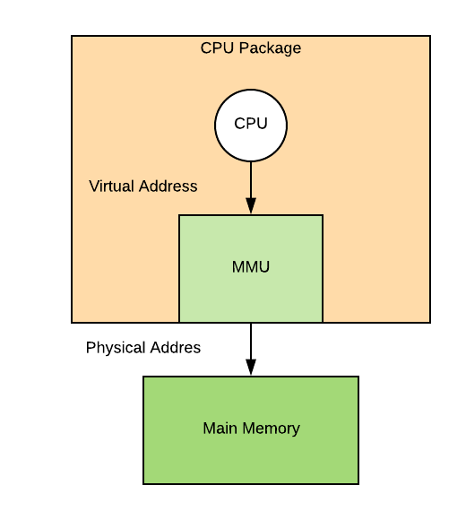
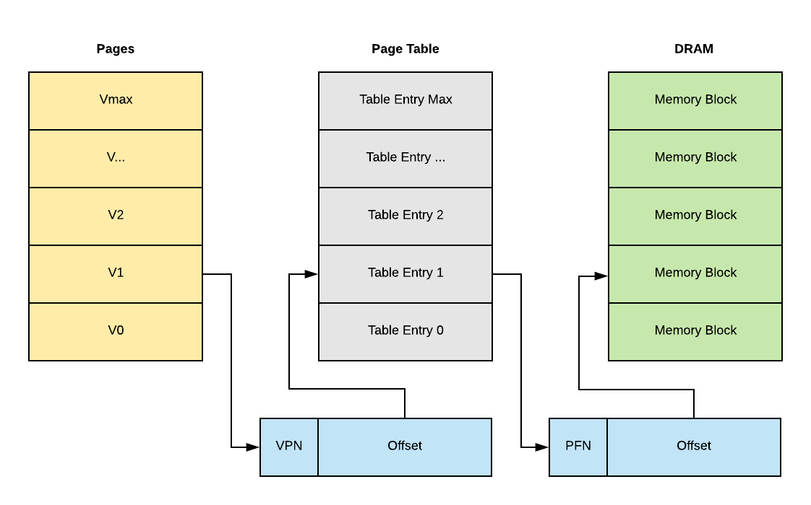
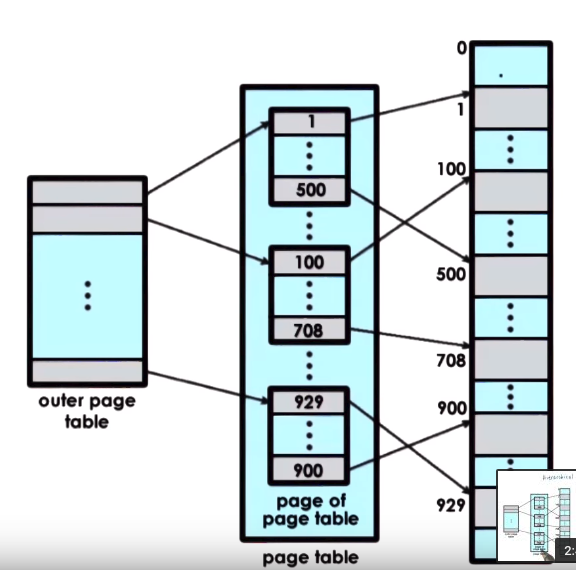
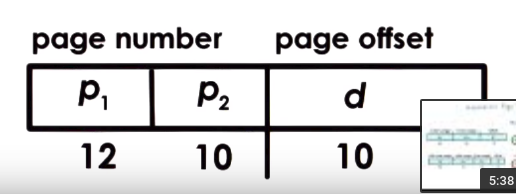

# Memory Management

The operating system has the following goals when it comes to memory management.

- Mapping of virtual memory addresses to physical memory addresses
- Allocate and replace memory i.e. when to fetch from disk, when to store to 
  disk
- Translate address and validate legality of the memory access

In page-based memory management, virtual memory is partitioned into fixed size
segments, called *pages*. Operating maps pages from the virtual memory into page
frames of the physical memory.

- Allocation is done with pages and page frames
- Arbitration is done via page tables

Hardware also plays an important role to aid operating system in memory
management. Each CPU has a MMU (Memory Management Unit) and it is responsible
for translating virtual memory to physical address.

CPU uses designated registers to point to the currently active page table. Cache
also implements a valid virtual to physical address translations, called TLB 
*Translation Lookaside Buffer*. The actual physical memory address is generated
by the hardware.

## Page Tables

Page table is like a map that tells the operating system and the hardware itself
where to find specific virtual memory references. The sizes of the pages of
virtual memory and the corresponding page frames in physical memory are
identical.

Each virtual address has a virtual page number (VPN) and an offset. This
corresponds to the physical frame number and the actual physical offset on
memory. In order to read a block of memory, we only need to know its offset on 
the memory block. For example, if we have declared an array in memory, although
it may have many elements, we only need to know the location of its first
element in order to access the subsequent elements. The location is indicated by
the offset.

When a data structure is first initialized, the page table does not contain
mapping of its virtual address to the physical memory yet, because OS hasn't
gotten the chance to allocate memory for it. Only at the time when the data
structure is being accessed, the OS will create the entry of page table for that
piece of data and allocate a physical page frame for it.

If a process hasn't used some of its memory pages for a long time, those pages
will be reclaimed. The content will no longer be present in physical memory. The
content will be pushed onto disks or discarded. On context switch, the OS must
switch the page table and update CPU MMU and registers.

### Page Table Entry

Each page table entry has a list of bits to indicate access permission.

- PFN: Page frame number
- Offset
- Present Bit (valid or invalid?)
- Dirty (whether has been written to? if so need an update on disk e.g. file)
- Accessed (read or write?)
- Protection (read, write permission)

### Page Table Size

The table has the number of entries that is equal to the number of virtual page
numbers that exist in a virtual address space. For every entry, the page table
needs to hold the physical frame number and other information like the
permission bits.

On a 32-bit architecture, each entry is 4 bytes (32 bits) including PFN and
flags. Each page size is about 4KB which is 2^12 bits. So in total, the number
of pages is about 2^32 / 2^12 which is 2^20. The maximum memory needed to hold
this giant table is 2^20 * 4 bytes which is about 4MB per process.

However, the process is unlikely to use the entire address space. But still,
under this design, we have to have an entry for every single virtual page
number.

### Multi Level Page Tables

We don't really design page tables in a flat manner anymore. Instead, page
tables have evolved from a flat page map to a more hierarchical multi-level
structure. A page table is broken into two level, outer and inner page table.

- Outer page table is called a page table directory
- Internal page table holds the valid mapping to physical frame number.

The virtual address will have three components, `<P1><P2><Offset>`. P1 is used
to index into the page directory, P2 is used to find the actual page of page
table and offset is used to locate the physical memory. The important thing here
is we don't need to allocate the memory for the pages of the internal page table
if it isn't being accessed. Instead of having all address space defined in a
flat page table architecture, we can now save some space by lazy allocation.

As we add mutliple levels, there are tradeoffs.

- Pro: Smaller internal page tables and directories, granularity of coverage,
  and reduce page table size.
- Con: More memory access is required for transaltion, which increases
  translation latency.

### Example

Suppose we have a 12-bit address space, which is 2^12 bit ~ 4kilobit, has an
address space where only the first 2 kilobits and last 1 kilobit are allocated
and used.

If we have a single-level page table, we need 2^6 entries on the table. If we
have 2 level page table then we will have 3 * 2^4 entries which is 48 entries,
notice that 16 entries are not allocated because they are not being used.

### Overhead

For a single leve page table, we only need 1 acess to page table entry and 1
access memory. For the multi-level case, e.g. four levels, we will need 4
accesses to page table entries and 1 access to memory. The extra accesses will
create overhead to the OS.

The most common way to address this problem is to use a **page table cache**,
TLB known as translation lookaside buffer.

### Page Size

Each entry is essentially one byte.

- 10-bit offset is equivalent to 1KB page size, because 2^10 possibilities
- 12-bit offset is equivalent to 4KB page size, because 2^12 possibilities

The popular choice is using 4KB page size on Linux, but it can go up to 2MB and
1GB. As we increase the page size, we will get the following effect.

- (+) Fewer page table entries, smaller page tables, more TLB hits
- (-) Internal fragmentation, more wasted memory

If we have a 12-bit architecture,

- If page size is 32 bytes, then we need 5 bits for offset into the page, i.e.
  2^5 bytes, and leave us 7 bits for the virtual page number, which is 2^7
  entries.

- If page size is 512 bytes, then we need 9 bites for offset into the page,
  i.e. 2^9 bytes, and leave us 3 bits for the virtual page number, which is
  2^3 entries.

## Memory Allocation

How does an operating system decide to allocate a particular portion of the
memory to a process? This is the job of the memory allocator. The memory
allocator is responsible for determining the virtual address to physical address
mapping.

- Kernel Level Allocators
  - Kernel State
  - Static Process State

- User Level Allocators
  - Dynamic Process State (Heap): `malloc` and `free`

### Memory ALlocation Challenge

Each memory request is required to be contiguous. It means that when you request
4 page frames, allocator must allocate you 4 consecutive blocks of frames
otherwise the request cannot be satisfied.

Imagine that we have 8 available frames and requests come in the following
order, 2 frames and 4 frames.

|Page Number | Allocated |
|------------|-----------|
| 1          | T         |
| 2          | T         |
| 3          | T         |
| 4          | T         |
| 5          | T         |
| 6          | T         |
| 7          | F         |
| 8          | F         |

Now the owner of the 2 frames is willing to free his memory.

|Page Number | Allocated |
|------------|-----------|
| 1          | F         |
| 2          | F         |
| 3          | T         |
| 4          | T         |
| 5          | T         |
| 6          | T         |
| 7          | F         |
| 8          | F         |

The next requester wants 4 frames but allocator cannot give those 4 available
frames to him because they are not contiguous.

### Linux Allocators

- Buddy Allocator
  - Start with 2^x area
  - On request: sub-divide into 2^x chunks and find the smallest 2^x chunk that
    can satisfy request.
  - On free: check buddy to see if you can aggregate into a larger chunk

This approach is like creating a heap using an array block of memory. Although
this algorithm still allows fragmentation to exist, it can aggregate data well
and fast to mitigate the fragmentation problem.

- Slab Allocator
  - Buddy allocator is not enough to address internal fragmentation problem
   because many objects in Linux kernel do not have size that is power of 2.
  - Slab allocator builds custom object caches on top of slabs. The slabs
    themselves represent contiguously allocated physical memory.

## Demand Paging

Since the physical memory (RAM) is much smaller than the addressable virtual
memory, allocated pages don't have to and can't always be present in physical
memory. Physical page frame can be saved and restored to/from hard disk. To swap
a page in/out of memory and swap partition (on disk,) we perform
**demand paging**.

> When should pages be swapped out?

Periodically when RAM reaches a particular threshold, the OS will run a page out
daemon that will look for pages that can be freed. Also OS will do it when CPU
usage is below threshold.

> Which pages should be swapped out?

OS simply uses a LRU cache to check which pages are most recently used and keep
them, otherwise evict them.