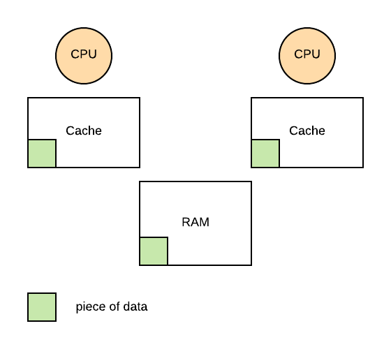
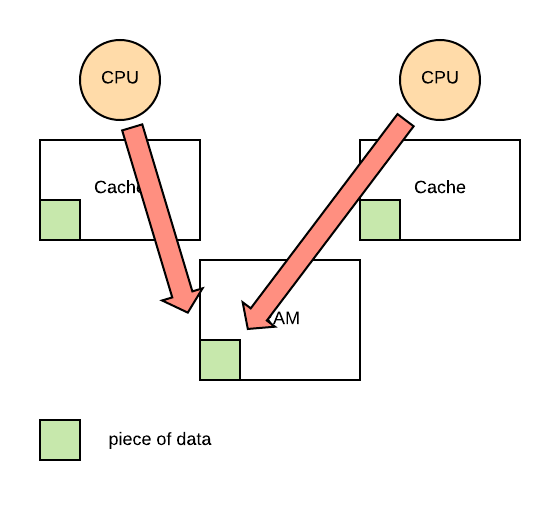

# Synchronization Constructs

Mutexes and condition variables have some limitations

- error prone: it's hard to keep track of many mutexes locking over
  different set of resources.
- lack of expressive power: it doesn't allow priority control, we can arbitrarily
  define synchronization condition.

## Spin Locks

Spin lock is like a mutex. It enforces mutual exclusion access. It has lock and
unlock API(s).

```c
spinlock_lock(s);
// critical section
spinlock_unlock(s);
```

Mutex puts a thread to sleep, but spin lock keeps the thread awake by spinning
it and constantly checking the lock state. It will burn CPU cycle until the lock
is freed.

### Spin Lock Support

Linux provides a standard library for spin locks.

```c
#include <linux/spinlock.h>

rwlock_t m;
read_lock(m);
// Critical section
read_unlock(m);

write_lock(m);
// Critical section
write_unlock(m);
```

### Semaphores

Semaphore is like a traffic light, it has STOP and GO. It's similar to mutex but
it's a more general term. Sempahore is represented by some positive integers.

1. On initialization, it is assigned a max value (positive integer)
2. On try or wait, if the current value is non-zero, decrement and proceed, else
   requester needs to wait.
3. On exit, it will increment the value

If semaphore is initialized with `max_value=1`, it is acting as a mutex.

### More Constructs

So far we have the following list

- Spinlock
- RWLock
- Mutex
- Semaphore
- Condition Variable
- Monitor

All of above requires some hardware support.

### How to Build Spinlock

Two *incorrect* and inefficient examples, because multiple threads can access the same variable at
the same time.

```c
spinlock_init(lock) {
    lock = free;
}

spinlock_lock(lock) {
    spin:
        if (lock == free) {
            lock = busy;
        } else {
            goto spin;
        }
}

spinlock_unlock(lock) {
    lock = free;
}
```


```c
spinlock_init(lock) {
    lock = free;
}

spinlock_lock(lock) {
    while (lock == busy);
    lock = busy;
}

spinlock_unlock(lock) {
    lock = free;
}

```

It is evident that we NEED hardware support to make mutual exclusion possible.

### Hardware Support

Hardware needs to provide a way to check and set the lock value indivisbly/atomically. Each type
of hardware or hardware architecture will support a number of atomic instructions.

For examples,

- `test_and_set`
- `read_and_increment`
- `compare_and_swap`

They all guarantees the following properties.

- Atomicity
- Mutual Exclusion
- Queue all concurrent instructions but one

Essentially atomic instructions are critical section with hardware supported synchronization. Using
the examples above, hardware support would allow only one thread to test and set a lock value ever.

```c
spinlock_lock(lock) {
    while (test_and_set(lock) == busy) {
        // spin
    }
}
```

`test_and_set` will atomically returns original value and set new value for a single thread if it
is not busy.

### Shared Memory Multiprocessors

In modern architecture, multiple CPU cores tend to access the same physical memory. In order to
improve performance of memory access, cores would have their own caches. When data are present in
cache, CPU will simply read from cache instead of RAM. However, if there's an update to memory,
there are couple things that may happen (depending on implementation.)

1. CPU is not allowed to write to cache to keep cache coherence
2. CPU writes through the cache and RAM at once
3. CPU writes to cache and actual update to memory location will be delayed.

### Cache Coherence

When multiple caches are presented in a multiprocessor architecture, cache coherence becomes a
major challenge.



There are two types of hardware support for cache coherence.

- Non-cache Coherent Architecture (relies on software to fix incoherent data.)
  - Perform write invalidate
- Cache Coherent Architecture (uses hardware to make cache update atomic.)
  - Perform write update to all caches

Write and invalidate approach has lowder bandwidth and amortized cost. Whenever a data in cache is
updated, all copies of the data will be invalidated in other cache. The write-update approach,
when a piece of data is updated in a cache, propagate the same change to all other caches. This
allows data to be immediately available.

Now here's the coolest part. What happens if we want an atomic update of a value for a
multi-processor program? Each CPU has its own cache, how does cache know if a piece of data is
being atomically accessed? When one CPU acquires the lock, how does all the other CPU know about
this event?

The solution is quite simple.

> Atomic operations do not perform on cache values, they go directly to memory modules (RAM.)



### Performance Consideration

We use three metrics to judge the implementation of a synchronization construct.

- Latency: the time to acquire a free lock, ideally zero
- Waiting time: the time to stop spinning and acquire a lock that has been freed, ideally zero
- Content: amount of bus or network traffic, e.g. CPU to RAM

The simple `test_and_set` spin lock implementation has the following properties.

- Low latency because checking integer value is effortless.
- Low wait time because it spins and checks.
- High contention because it uses a lot of network activities.

We can potentially fix it by allowing the CPU to checks the cache instead of reaching over to the
RAM.

```c
// test cache, but test and set RAM
// spins on cache (lock == busy)
// atomic if freed (test_and_set)
spinlock_lock(lock) {
    while ((lock == busy) OR (test_and_set(lock) == busy)) {
        // spin
    }
}
```

But it depends, if we have a non-cache coherent architecture, it makes no difference because
every single memory reference will have to go to memory.

If we have cache coherence with write update, then it is not too bad. Hardware will take care of the
updates and make sure each test check has the correct free or busy value.

If we have cache coherence with write invalidate, then it is actually bad. Every single attempt to
acquire the lock, it will generate contention for the memory module and create invalidation traffic.
Because the outcome of an atomic instruction will always invalidate a cache.

Essentially as soon as someone performs an atomic instruction, and before the cache coherence
occurs, the test check will always have to visit memory to find the correct lock value.

### Spinlock Delay

We can solve it by allowing the system to perform cache update via giving it a bit of delay.

```c
spinlock_lock(lock) {
    while((lock == busy) OR (test_and_set(lock) == busy)) {
        // failed to get lock
        while (lock == busy) {
            // spin
        }
        delay();
    }
}
```

Everyone sees that lock is free, but not everyone attempts to acquire it. But this implementation
makes delay worse due to the additional delay.