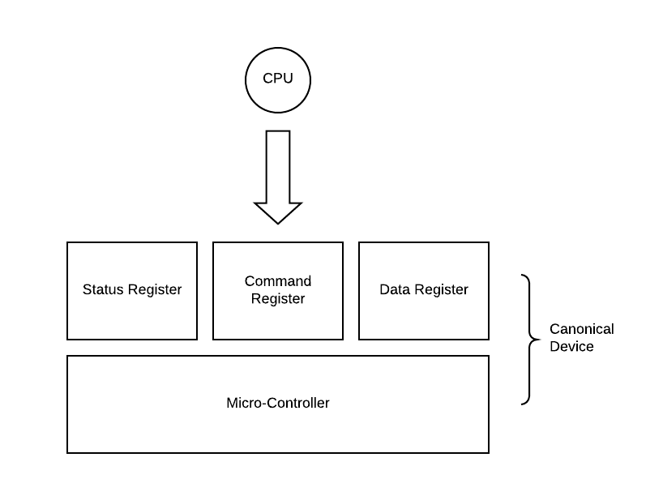
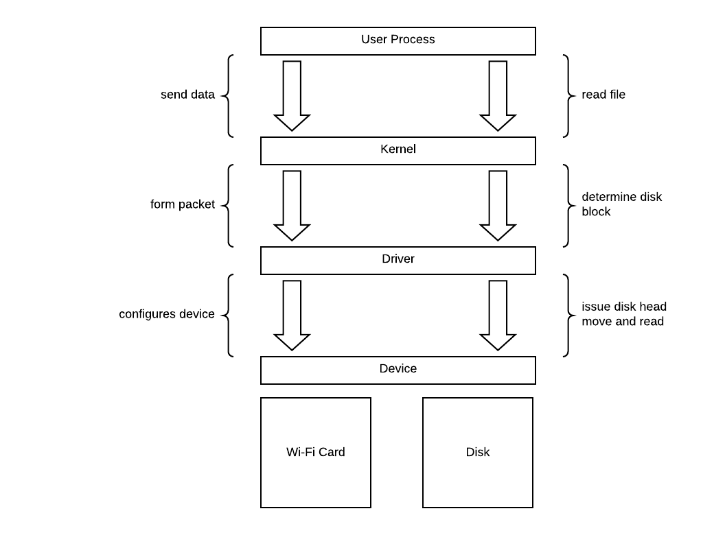
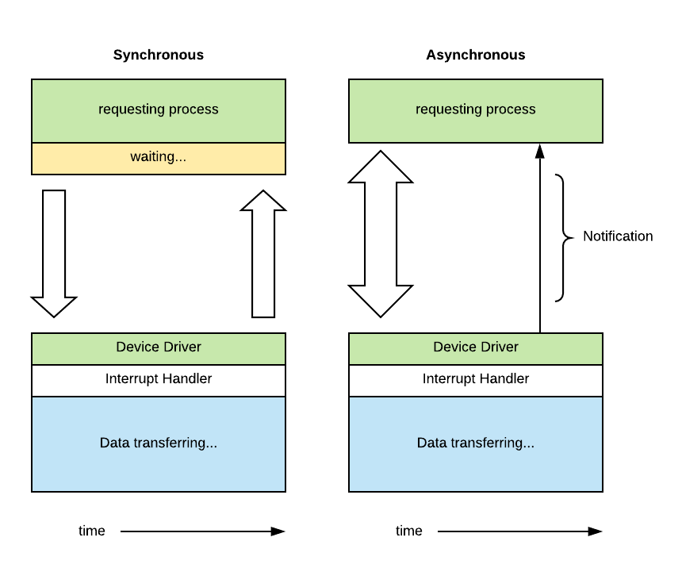
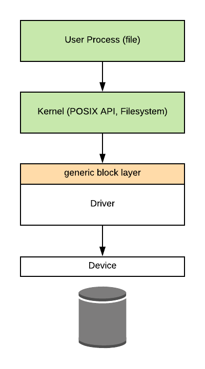
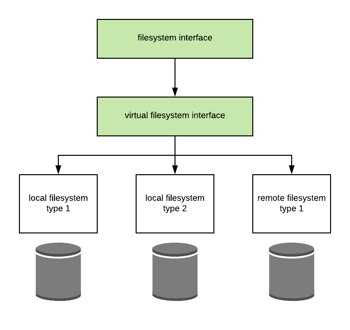

# I/O Management

IO is like a toy shop shipping department.

- It has protocols, which are interfaces for physical devices.
- It has dedicated handlers, like device drivers, interrupt handlers and etc...
- It decouples I/O details from applications.

IO devices encompass a lot of things. Input devices are like keyboard and mouses. Output devices
are like monitor and speakers.

## Devices

### I/O Device Features

Any device will have a set of control registers that can be accessed by the CPU and that permit the
CPU device interactions. Control registers are divided into the following categories.

- Command - CPU tells what device should do.
- Data - CPU transfers data into and out of the device.
- Status - CPU can find out what is exactly happening on the device.

Device would also have a microcontroller which is basically a device's CPU. Device also has memory.

### CPU Device Interconnect

We often hear PCI slots when we build computers. PCI stands for peripheral component interconnect.
It is the standard of connecting devices to the CPU. PCI is a bus. Multiple devices can be plugged
in and CPU will have access to all of them.

### Device Drivers

OS kernel requires device driver for every type of device connected to the system. Each driver is
responsible for device access, management and control. Typically hardware supplier implements
and provides the drivers for all compatible OS (Windows, Mac, Linux etc...)

In order to support device diversity, OS typically groups devices by the following categories.

- Block (Disk Storage)
  - Enable read and write blocks of data
  - Direct access to arbitrary block of data
- Character (Keyboard)
  - Get or put a character
  - Data are delivered character by character.
- Network
  - Stream a sequence of data in and out

Operating system maintains a representation for each device that is connected to the system via
encapsulate them as files. In UNIX based systems, all devices appear as files underneath `/dev`
directory.

For example, when we want to print some content using line printer, we would do the following.

```bash
cp file > /dev/lp0
cat file > /dev/lp0
echo "Hello World" > /dev/lp0
```

Linux provides a number of pseudo "virtual" devices that provide special functionality to a system.

- `/dev/null` accepts and discard all output.
- `/dev/random` generates a random number.

### CPU Device Interactions

The main way in which PCI interconnects devices to the CPU is by making devices accessible in a
manner that's similiar to how CPU accesses memory. The device registers appear to the CPU as
memory locations at a specific physical address. When CPU writes to these locations, the integrated
memory PCI controller realizes that this access should be routed to the appropriate device.

This means that a portion of the physical memory on that computing system is dedicated for
interactions with the device. We call this **memory-mapped I/O**.

In addition, the CPU can access devices via special instructions. Each of the instructions has to
specify the target device via I/O port.

### Programmed IO

With just basic supoprt from PCI and the corresponding PCI controllers on the device, a system
can access or request an operation from a device using a method called **programmed I/O**.



CPU can instructs the device via writing to command registers and move data around by accessing the
data registers of the device. For example, CPU uses a network interface card to send TCP packet via
programmed IO.

1. CPU writes command to request packet transmission
2. CPU copies packet to data registers
3. Repeat until packet is sent

For a 1500 bytes packet and 8 bytes registers, it would take 1 access to write the command and 188
accesses to transfer data.

An alternative to programmed IO is to use DMA supported devices. We will have a DMA controller that
sits between CPU and data register.

1. CPU writes command to request packet transmission
2. CPU configures DNA controller with in-memory address and size of packet buffer.

The benefit of this approach is greatly reducing the number of CPU operations needed to send a
packet because DMA will take care of copying data to data registers and wait for it to be sent.
However, data buffer must be in physical memory until transfer completes.

### Device Access

A process needs to peform an operation that requires access from a hardware device, like reading a
file from disk or sending a packet across network. The process will perform a system call in which
it will specify the appropriate operation. The process is effectively requesting an operation from
the kernel.

The operationg system will then run the in-kernel stack to format the data correctly and invoke the
device driver. The driver will perform the configuration of request to the actual device. Finally,
once the device is configured, it will perform the actual request.



Block devices like disks, are typiclaly used for storage. Operationg system abstract storage using
file, think of it as a logical storage unit. File is mapped to some underlying physical storage
location. At the top most level, applications don't think about disks and blocks, instead they think
about files and lines.

### Async Access

When a thread tries to access a physical device, it is making an IO call. There are two types
of IO call, synchronous and asynchronous. This depends on OS implementation for particular call.



Alternatively, if the OS is not supporting an async IO, user may create a thread that handles
synchronous IO operation. Let OS performs context switch to enable other threads to perform
meaningful work while waiting for IO operation to complete. Most of the data transfer does not
involve CPU. The device performs the heavy lifting.

## Filesystem

Application level does not think about physical storage as data blocks. Instead, application
uses file as an abstraction for data manipulation.



> What if files are on more than one device?
> What if devices work better with different filesystem implementation?
> What if files are not on a local device, but instead access via network?

### Virtual Filesystem (VFS)

To deal with the concerns above, Linux uses a virtual file system interface to hide all
details regarding the underlying file system. The virtual file system supports several
key abstractions.

**Files** are elements on which the VFS operates.

**File descriptors** are OS representation of file, they support `open`, `read`, `write`,
`sendfile`, `lock`, `close`, and etc...

**Inode** is a persistent representation of file "index", hence it's index node. It provides
the list of all data blocks. It provides device, permission, and size information. This
allows file to be not stored contiguous on disk. It could be randomly scattered. A file name
is mapped to a single inode. The inode provides information on how to retrieve all data of
the file.

**Superblock** provides file system hierarchical information, e.g. how many data blocks, how many inodes,
and how many free blocks.

**Dentry** is a directory entry, corresponds to a single path component like `/users`, `/var/log`.
Directory entry is just a soft state, there isn't no persistence on this abstraction.


Certain file system places a file size limit, like Windows previoulsy had a 4GB limit on files. This
is because the size restriction of how many indices a inode can hold. 


