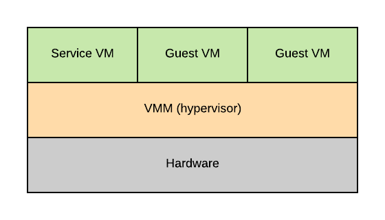
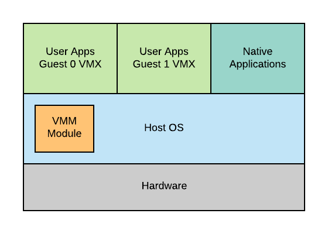

# Virtualization

Virtualization allows concurrent execution of multiple operating systems and their applications
on the same physical machine. Each OS thinks that it "owns" hardware resources but in reality 
the resources are virtual. Each operating system and its applications together are called 
a *virtual machine*.

## Virtualization Layer

The classical definition of a virtual machine is an efficient, isolated duplicate of the real
machine. VM si supported by a virtual machine monitor (VMM.)

- Fidelity: VMM provides environment essentially identical with the original machine.
- Performance: Programs should show at worst only minor decrease in speed.
- Safety: VMM is in complete control of system resources.

## Virtualization Models

There are two virtualization models. 

### Bare-metal

This is also called Hypervisor-based. VMM manages all hardware resoureces and supports execution
of VM(s). It runs a service VM that runs a standard operating system and has full hardware
priviledges to access and perform any kind of hardware manipulation. The service VM deals with
devices and other configuration and management tasks.

### Hosted

The other model is hosted virtualiation. In this model, at the lowest lefvel, there is a full
fledged host operating system that manages all of the hardware resources. The host OS
integrates a virtual machine monitor module, that's responsible for providing the virtual
machines with their virtual platform interface and for managing all of the context switching
scheduling and etc...

## Processor Virtualization

Guest instructions are executed directly by the hardware. The virtual machine monitor does not
interfere with every single instruction that is isseued by the guest operating system. As long as
the guest operating system and its applications operate within the resources that were allocated
to the VM, then everything is operating at its full hardware speed. 

Whenever a priviledged instruction gets accessed, then the processor causes a trap, and control
is automatically switched to the most priviledged level, so to the hypervisor. 

Hypervisor will decide whether the operation is legal or illegal.

- If illegal, terminate the VM
- If legal, VMM emulates the behavior the guest OS was expecting from the hardware.

### x86 Problems

However, a problem came up in the late 90s when x86 had 4 rings and no root/non-root mode. 
The hypervisor sits in ring 0 (highest priviledge mode) and guest OS sits in ring 1. Pre 2005,
there were 17 priviledged instructions that do no trap and fail silently, e.g. interrupt 
enable/disable bit in priviledged register, `POPF` and `PUSHF` instructions that acess it from
ring 1 would fail silently.

Hypervisor doesn't know so it doesn't try to change settings. OS doesn't know, so it assumes
change was successful.

### Binary Translation

VMWare pioneered the concept of binary translation. It dynamically performs binary translation.

1. Inspect code blocks to be executed
2. If needed, translate to alternate instruction sequence, e.g. to emulate desired behavior
3. Otherwise, run at hardware speeds

## Memory Virtualization

Memory full virtualization has the following reuquirements.

- All guests expect contiguous physical memory, starting at index 0
- We distinguish three types of addresses
  - Virtual addresses
  - Physical addresses (the guest machine thinks it owns)
  - Machine addresses

### Option 1

The guest page table maps virtual addresses to physical addresses. The hypervisor page table
maps physical addresses to machine addresses.

### Option 2

The guest page table maps virtual addresses to physical addresses. The hypervisor uses a 
shadow page table to map virtual addresses to machine addresses directly. It skips the translation
layer between physical addresses to machine addresses. However, hypervisor needs to maintain 
consistency, e.g. invalidate on context switch, write-protect guest page table to track new mappings.

Memory paravitualization has the following implication.

- Guest is aware of virtualization
- No longer strict requirement on contiguous physical memory start at 0
- Explicitly register page tables with hypervisor
- Can batch page table updates to reduce VM exits