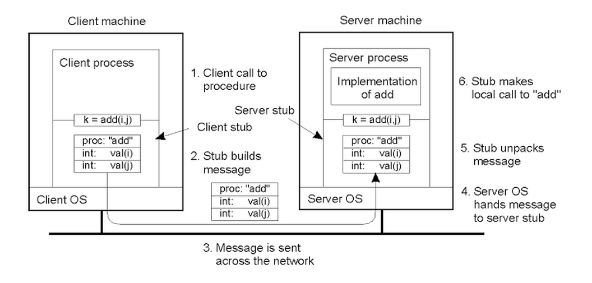

# Remote Procedure Calls

## Benefits & Requirements of RPC

RPC is intended to simplify the development of cross address space and cross machine interactions.

- It provides higher level interface for data movement and communication.
- It provides error handling.
- It hides the complexity of cross-machine interactions.

In order to implement RPC, one should satisfy the following requirements.

- Logic for client and server interactions
- Procedure call interface should be synchronous
- Type checking for error handling and packet bytes interpretation
- Cross-machine conversion like big to little endian for integers
- Higher-level protocol for access control, fault tolerance, and different transport protocols

## Interaction

The following is a generic RPC structure for machine to machine interaction using RPC.

1. *Binding* - Client finds and binds to the desired server, e.g. establishing TCP connection.
2. *Call* - Client makes RPC call, control passed to stub, client code blocks.
3. *Marshal* - Client stub marshals arguments, i.e. serialize arguments into buffer.
4. *Send* - Client sends messages to server.
5. *Receive* - Server receives message, passes message to server stub and access control.
6. *Unmarshal* - Server stub unmarshals arguments, i.e. deserialize arguments into data structures.
7. *Actual Call* - Server stub calls local procedure implementation.
8. *Result* - Server performs operation and computes result of RPC operation.

The remaining steps are to return data back to client following the similiar steps above.

## Interface Definition Language

In the context of gRPC, protobuf is the IDL. An IDL used to describe the interface server exports
should provide the following features.

- Procedure name and arguments
- Version number
- Language agnostic

Protobuf provides serialization/deserialization that satisfies the features above. Notice that sending
pointers to another machine with a different address space is meaningless. Typically, IDL would either

- Disallow all pointers
- Serialize pointers and copy referenced data structure

## Error Handling

RPC cannot provide a specific answer to why something fails. Usually RPC would provide a special
RPC error notification that would capture any of the following failures.

- client packet lost
- server packet lost
- network link down
- server machine down
- server process failed
- server process overloaded

> Not going to dive too much into the details of SunRPC and XDR because they are irrelevant
> technologies now.
