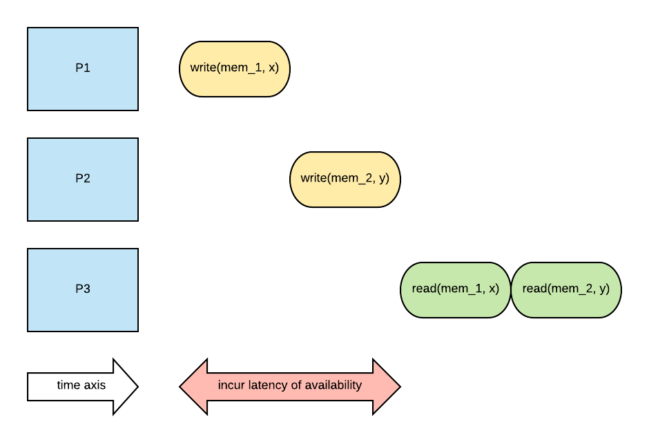
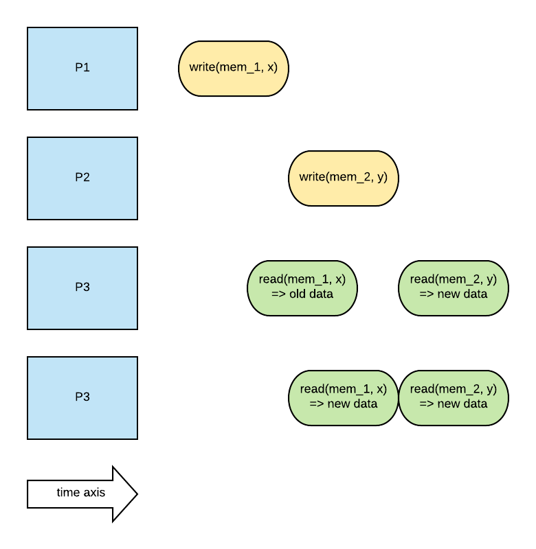

# Distributed Shared Memory

This is the type of system that will perform distributed state management. We will discuss several
consistency models that are commonly used in systems that manage distributed and shared state.

In distributed filesystem, servers own and manage state (files) and provide file access to clients
upon request. In the case of distributed shared memory, there isn't a clear distinction between
server and client because the state is distributed across all nodes of an application. The nodes
become indistinguishable in terms of role.

In distributed shared memory, each node owns state, i.e. memory and provides services like memory
read/writes and consistency control via protocols. DSM is important to study because they permit
scaling beyond the limitations of how much memory we can include in a single machine.

Remote direct memory access (RDMA) has significantly sped up data transfer between commodity
machines within the same data center. The latency of remote access is much better these days.

## Design Considerations

When considering the design of a distributed shared memory system, there are couple important to
discuss.

### Sharing Granularity

How granular should the sharing be? 

- Page Granularity (OS Level)
- Object Granularity (Language Runtime)

### Access Algorithm

- Single reader and single writer (what's the point...)
- Multiple readers and single writer
- Multiple readers and multiple writers (this is probably the most common case.)

### Replication vs Migration

Migration makes very little sense for multiple reader/writers. Replicate it. Replication requires
consistency management.

### Consistency 

In shared memory multiprocessor, consistency is managed with two mechanism. 

1. Write invalidate: whenever the content of particular memory location that is cached to multiple
   caches is changed on one CPU in one cache. The change will be propagate to other caches and
   invalidate their content. 

2. Write update: same as above except it copies data over and update other caches.

These coherence operations are triggered on each write. The overhead may be too high for DSM. We
need to push changes less frequently. More consistent models below.

## DSM Architecture

This is a page based distributed shared memory architecture. There are multiple distributed nodes,
each owns and provides local memory contribution. The cluster of nodes creates a pool of pages. Each
page has ID and page frame number that is unique. The ID provides an identification for the node
that owns the page. 

The node where the page is located is called *home* node. Sometimes I like to call it the host. 
Pages will be cached on the nodes where they are accessed. The home nodes will drive the coherence
operations for syncing up with replicas or slaves. This is assuming that data are partitioned.

All nodes are effectively responsible for portion of distributed memory state management. This is 
like Cassandra.

Home nodes keep states like pages accessed, modifications, caching enabled/disabled and locking.

### Indexing Distributed State

One important problem for DSM is that how do we determine where page is when we perform a look up.
The DSM maintains meta data that specifies

- Address is node ID and page frame number
- Node ID is address of the home node

Now the interesting part is that the system maintains the global mapping of page ID to home node ID.
The global map is available on each node. Clearly the global map needs to be replicated and
propagated throughout the whole system. The home node will then maintain another meta data that 
specifies the location of actual memory locally.

## Consistency Models

Consistency model is an agreement between memory state and upper software layers. That is, memory
behaves correctly if and only if software follows the rules imposed by the agreement. Correct
behavior factors in access ordering and propagation of updates

### Strict Consistency

Strict consistency means updates are visible to everywhere immediately. While the updates are being
applied, clients are not allowed to read until it is finished.

In theory, strict consistency is impossible to achieve in distributed system due latency and messages
reorder or loss as they travel through the network. For a single node, it is impossible to achieve
without any lock or synchronization mechanism.

### Sequential Consistency

Sequential consistency means updates from different processors may be arbitrarily interleaved.

However, all processes must see the same ordering of updates being applied.

### Casual Consistency

Casual consistency means that model guarantees detection of possible casual relationship between
updates. If the updates are casually related, the memory will guarantee that those update operations
are correctly ordered. If there are concurrent writes, casual consistency does not guarantee 
ordering. That is some processes will see some parts of the new pdates while others will see parts
or more of the new updates.

### Weak Consistency

Weak consistency model introduces sychronization points in time. 

- All updates prior to a sync point will be visible.
- No guarantee what happens in between the sync point.

