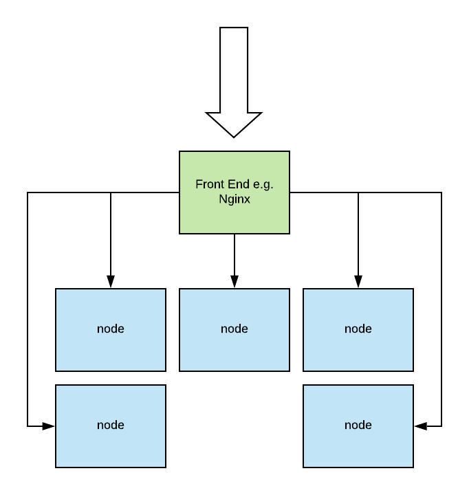

# Datacenter Technologies

Some of the materials from this lesson are a bit outdated compared to industrial standard. I won't
take too much notes in this lesson.

## Internet Service

### Homogenous Architecture

Any node can process any type of request, there is no specialization. There will be a load balancer
sitting in front of the cluster and it is called the "boss". The workers are the individual server
or machines that perform the processing. This is commonly known as the monolithic architecture.

- **+** Front end node is simple, but doesn't mean that each node has all data, just each node can 
  get to all data.
- **-** There is little opportunity to benefit from caching.

### Heterogenous Architecture

Different nodes are designated to perform different functions. Data doesn't have to be uniformally
accessible everywhere. This is commonly known as the service oriented architecture.

- **+** It has the benefit of locality and caching.
- **-** Front end node becomes more complex. A single Nginx won't cut it.
- **-** Whole architecture becomes more complicated.

Important reading material from Eric A. Brewer at Berkeley 

[Lessons From Giant-Scale Services](https://people.eecs.berkeley.edu/~brewer/Giant.pdf)

## Cloud Computing

Why does cloud computing work? 

- *Law of Large Numbers* Although there is a large variation in resources needs per customer, average
  across many customers is roughly the same.
- *Economy of Scale* The unit cost of providing resources or services drops significantly at bulk.

In 1961, John McCarthy predicted that, 

> If computers of the kind I have advocated become the computers of the future, then computing may
> some day be organized as a public utility, just as the telephone system is a public utility. The
> computer utility could become the basis of a new and important industry.

However the modern landscape of cloud computing has yet to reach that state. Limitation exists in
the form of hardware dependency and API lock-in to a particular vendor.

### Cloud Deployment Models

- Public: third party customers/tenants
- Private: leverage technology internally
- Hybrid: use public resources for failover but generally rely on private resources
- Community: used by certain type of users

### Cloud Service Models

*SP* stands for service provider. 

| Model                       | Examples          | Applications | Data | Runtime | Middleware | OS  | Virtualization | Servers | Storage | Networking | 
|-----------------------------|-------------------|--------------|------|---------|------------|-----|----------------|---------|---------|------------|
| On Premises                 |                   | You          | You  | You     | You        | You | You            | You     | You     | You        |
| Infrastructure as a Service | AWS EC2           | You          | You  | You     | You        | You | SP             | SP      | SP      | SP         |
| Platform as a Service       | Google App Engine | You          | You  | SP      | SP         | SP  | SP             | SP      | SP      | SP         |
| Software as a Service       | Gmail             | SP           | SP   | SP      | SP         | SP  | SP             | SP      | SP      | SP         |
