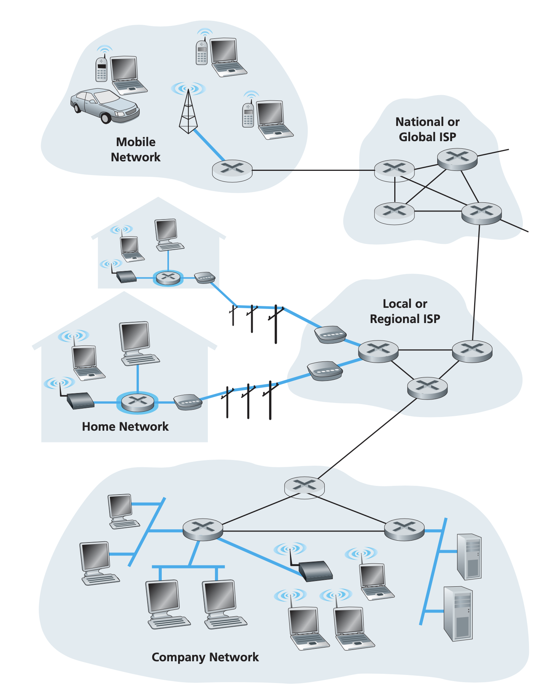

# Computer Networking a Top-Down Approach

## Reading List

- [x] Chapter 1 Computer Networks and the Internet
- [ ] Chapter 2 Application Layer
- [ ] Chapter 3 Transport Layer
- [ ] Chapter 4 Network Layer
- [ ] Chapter 5 Link Layer
- [ ] Chapter 6 Wireless and Mobile Networks
- [ ] Chapter 7 Multimedia Networking
- [ ] Chapter 8 Security in Computer Networks
- [ ] Chapter 9 Network Management

## Computer Networks and Internet

### Network Edge

The edge refers to the end systems of a computer network. In most cases, they are servers and client
programs. However, access networks are another common "edges". They are the physical links that
connect an end system to the first router, also known as the edge router. Many of the access technologies
employ portions of the traditional local wired telephone infrastructure. The local wired telephone
infrastructure is provided by a local telephone provider, which we will simply refer as the local
**telco**.

The access links are highlighted in thick blue lines.

### Network Core

The core of the network is a mesh of packet switches and links that interconnects the end systems.
There are two fundamental approaches to moving data through a network of links and switches:
**circuit switching** and **packet switching**.

In circuit-switched networks, the resources needed, along a path to provide for communication
between the end systems, are reserved for the duration of the communication session between the end
systems. This is analogous to making a reservation for a table for dinning.

In packet-switched networks, these resources are not reserved; a session's messages use the
resources on demand, and as a consequence, may have to wait for access to a communication link. This
is analogous to showing up to a restaurant and order food. Depending on how busy the restaurant is,
the customers may need to wait in line before ordering food.

In the public Internet, access ISPs situated at the edge of the Internet are connected to the rest
of the Internet through a tiered hierarchy of ISPs. Access ISPs are at the bottom of this hierarchy.
At the very top of the hierarchy is a relatively small number of so-called tier 1 ISPs. They are
known as the **Internet backbone** networks. A tier-2 ISP typically has regional or national
coverage, and connects to only a few of the tier-1 ISPs. A tier-2 ISP is said to be a customer of
the tier-1 ISP to which it is connected. Users and content providers are customers of lower-tier ISPs,
and lower-tier ISPs are customers of higher-tier ISPs.

### History of Computer Networking

- 1960s Packet Switching
- 1970s TCP, UDP, and IP
- 1980s Standardization of TCP/IP and proliferation of networks
- 1990s HTTP, server and browser, explosion of wide adoptions
