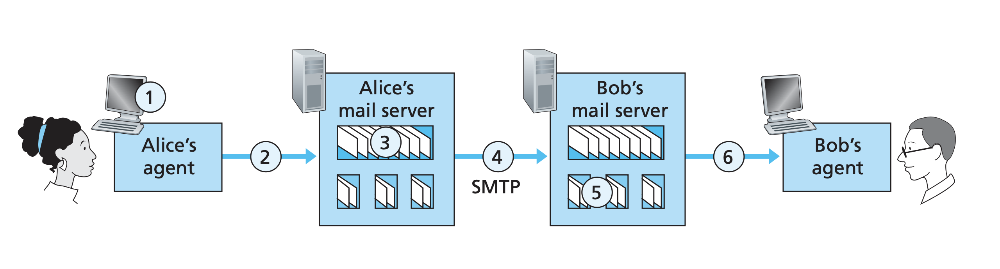

# Computer Networking a Top-Down Approach

## Reading List

- [x] Chapter 1 Computer Networks and the Internet
- [ ] Chapter 2 Application Layer
- [ ] Chapter 3 Transport Layer
- [ ] Chapter 4 Network Layer
- [ ] Chapter 5 Link Layer
- [ ] Chapter 6 Wireless and Mobile Networks
- [ ] Chapter 7 Multimedia Networking
- [ ] Chapter 8 Security in Computer Networks
- [ ] Chapter 9 Network Management

## Computer Networks and Internet

### Network Edge

The edge refers to the end systems of a computer network. In most cases, they are servers and client
programs. However, access networks are another common "edges". They are the physical links that
connect an end system to the first router, also known as the edge router. Many of the access technologies
employ portions of the traditional local wired telephone infrastructure. The local wired telephone
infrastructure is provided by a local telephone provider, which we will simply refer as the local
**telco**.

The access links are highlighted in thick blue lines.


### Network Core

The core of the network is a mesh of packet switches and links that interconnects the end systems.
There are two fundamental approaches to moving data through a network of links and switches:
**circuit switching** and **packet switching**.

In circuit-switched networks, the resources needed, along a path to provide for communication
between the end systems, are reserved for the duration of the communication session between the end
systems. This is analogous to making a reservation for a table for dinning.

In packet-switched networks, these resources are not reserved; a session's messages use the
resources on demand, and as a consequence, may have to wait for access to a communication link. This
is analogous to showing up to a restaurant and order food. Depending on how busy the restaurant is,
the customers may need to wait in line before ordering food.

In the public Internet, access ISPs situated at the edge of the Internet are connected to the rest
of the Internet through a tiered hierarchy of ISPs. Access ISPs are at the bottom of this hierarchy.
At the very top of the hierarchy is a relatively small number of so-called tier 1 ISPs. They are
known as the **Internet backbone** networks. A tier-2 ISP typically has regional or national
coverage, and connects to only a few of the tier-1 ISPs. A tier-2 ISP is said to be a customer of
the tier-1 ISP to which it is connected. Users and content providers are customers of lower-tier ISPs,
and lower-tier ISPs are customers of higher-tier ISPs.

### History of Computer Networking

- 1960s Packet Switching
- 1970s TCP, UDP, and IP
- 1980s Standardization of TCP/IP and proliferation of networks
- 1990s HTTP, server and browser, explosion of wide adoptions

## Application Layer

### HTTP

HTTP is defined in RC 1945 and RFC 2616. HTTP is implemented in two programs: a client program and
a server program. The client program and server program, executing on different end systems, talk to
each other by exchanging HTTP messages. HTTP defines the structure of these messages and how the
client and server exchange messages.

HTTP uses TCP as its underlying transport protocol (rather than running on top of UDP). The HTTP
client first initiates a TCP connection with the server. Once the connection is established, the
browser and the server processes access TCP through their socket interfaces.

HTTP need not worry about lost data or the details of how TCP recovers from loss or re-ordering of
data within the network. That is the job of TCP and the protocols in the lower layers of the
protocol stack.

#### HTTP Message Format

- Line 1 is start line
- Line 2 to 10 are headers
- Line 11 and rest are body

```text
POST / HTTP/1.1
Host: localhost:8000
User-Agent: Mozilla/5.0
Accept: text/html
Accept-Language: en-US
Accept-Encoding: gzip
Connection: keep-alive
Upgrade-Insecure-Requests: 1
Content-Type: multipart/form-data
Content-Length: 345
<!DOCTYPE HTML>
<html>
</html>
```

#### Set Cookies

This is different from local storage because cookies are set by server responses. The cookie technology
has four components.

1. Cookie header line in HTTP response message
2. Cookie header line in HTTP request message
3. Cookie file kept on user's ned system and managed by the browser
4. Server database for keep tracking of data from cookies

Suppose I visit Amazon and shop for keyboards. Amazon creates a unique identification for my browsing
session when I make the first request to Amazon.com. The response will contain a header,

```text
Set-cookie: <unique_id>
```

The browser sees the header and proceeds to set the cookie. Next time when I revisit Amazon, my
request will contain the cookie ID and Amazon can use this ID to retrieve my shopping cart.

### SMTP

We need to define terminology before proceeding.

- User agent allows users to read, reply to, forward, save, and compose messages.
  - Before the time of browser-based Gmail and Hotmail, Microsoft Outlook was the agent.
- Mail server is a server which implements SMTP, e.g. @gmail.com, and @hotmail.com
- Message queue is implemented in each mail server in case of failure to send.

Supose we have Alice and Bob, Alice wants to send an email to Bob.

1. Alice invokes her user agent for email, provides Bob's email address, composes a message, and
  instructs the user agent to send the message.
2. Alicer's user agent sends the message to her mail server, where it is placed in a message queue.
3. The client side of SMTP, running on Alice's mail server, sees the message in the queue. It opens
  a TPC connection to another SMTP server, running on Bob's mail server.
4. After initial SMTP handshaking, the SMTP client sends Alice's message into the TCP connection.
5. At Bob's mail server, the server side of SMTP receives the message. Bob's mail server then places
  the message in Bob's mailbox.
6. Bob invokes his user agent to read the message his convenience.

