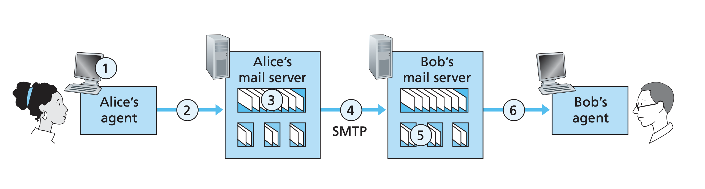

# Application Layer

## HTTP

HTTP is defined in RC 1945 and RFC 2616. HTTP is implemented in two programs: a client program and
a server program. The client program and server program, executing on different end systems, talk to
each other by exchanging HTTP messages. HTTP defines the structure of these messages and how the
client and server exchange messages.

HTTP uses TCP as its underlying transport protocol (rather than running on top of UDP). The HTTP
client first initiates a TCP connection with the server. Once the connection is established, the
browser and the server processes access TCP through their socket interfaces.

HTTP need not worry about lost data or the details of how TCP recovers from loss or re-ordering of
data within the network. That is the job of TCP and the protocols in the lower layers of the
protocol stack.

### HTTP Message Format

- Line 1 is start line
- Line 2 to 10 are headers
- Line 11 and rest are body

```text
POST / HTTP/1.1
Host: localhost:8000
User-Agent: Mozilla/5.0
Accept: text/html
Accept-Language: en-US
Accept-Encoding: gzip
Connection: keep-alive
Upgrade-Insecure-Requests: 1
Content-Type: multipart/form-data
Content-Length: 345
<!DOCTYPE HTML>
<html>
</html>
```

### Set Cookies

This is different from local storage because cookies are set by server responses. The cookie
technology has four components.

1. Cookie header line in HTTP response message
2. Cookie header line in HTTP request message
3. Cookie file kept on user's ned system and managed by the browser
4. Server database for keep tracking of data from cookies

Suppose I visit Amazon and shop for keyboards. Amazon creates a unique identification for my
browsing session when I make the first request to Amazon.com. The response will contain a header.

```text
Set-cookie: <unique_id>
```

The browser sees the header and proceeds to set the cookie. Next time when I revisit Amazon, my
request will contain the cookie ID and Amazon can use this ID to retrieve my shopping cart.

## FTP

In a typical FTP session, the user is sitting in front of localhost and wants to transfer files to
or from a remote host. User sends identification and password to the remote host. Once
authenticated, user can transfer files from/to remote host.

HTTP and FTP are both file transfer protocols and have many common characteristics, e.g. both run on
TCP. However there are some important differences.

> FTP uses two parallel TCP connectiosn to transfer a file, a **control connection** and a
  **data connection**.

The control connection is used for sending control information between two hosts. The data
connection is used to actually send a file. FTP is said to send its control information
**out of band** while HTTP is said to send its control information **in band**.

When a user starts an FTP session, the client side first initiates a control TCP connection with
server side on server port 21. When the server side receives a command for a file transfer over the
control connection, the server side initiates a TCP data connection to the client side. FTP sends
exactly one file over the data connection and then closes the data connection. The control
connection remains open until session is over.

## SMTP

We need to define terminology before proceeding.

- User agent allows users to read, reply to, forward, save, and compose messages.
  - Before the time of browser-based Gmail and Hotmail, Microsoft Outlook was the agent.
- Mail server is a server which implements SMTP, e.g. @gmail.com, @hotmail.com, etc...
- Message queue is implemented in each mail server in case of failure to send.

Supose we have Alice and Bob, Alice wants to send an email to Bob.

1. Alice invokes her user agent for email, provides Bob's email address, composes a message, and
  instructs the user agent to send the message.
2. Alicer's user agent sends the message to her mail server, where it is placed in a message queue.
3. The client side of SMTP, running on Alice's mail server, sees the message in the queue. It opens
  a TPC connection to another SMTP server, running on Bob's mail server.
4. After initial SMTP handshaking, the SMTP client sends Alice's message into the TCP connection.
5. At Bob's mail server, the server side of SMTP receives the message. Bob's mail server then places
  the message in Bob's mailbox.
6. Bob invokes his user agent to read the message his convenience.



HTTP is mainly a pull protocol. SMTP is primarily a push protocol. SMTP requires each message,
including the body of each message, to be in 7-bit ASCII format.
